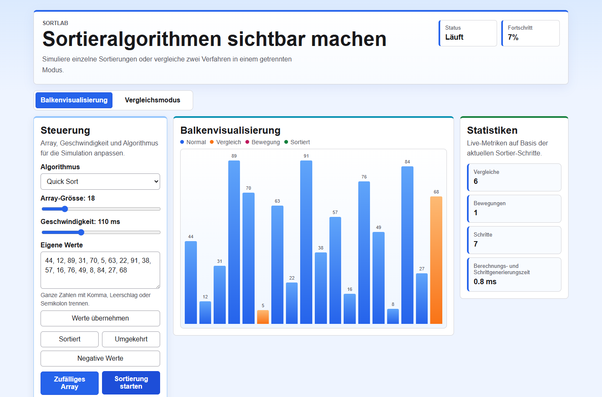
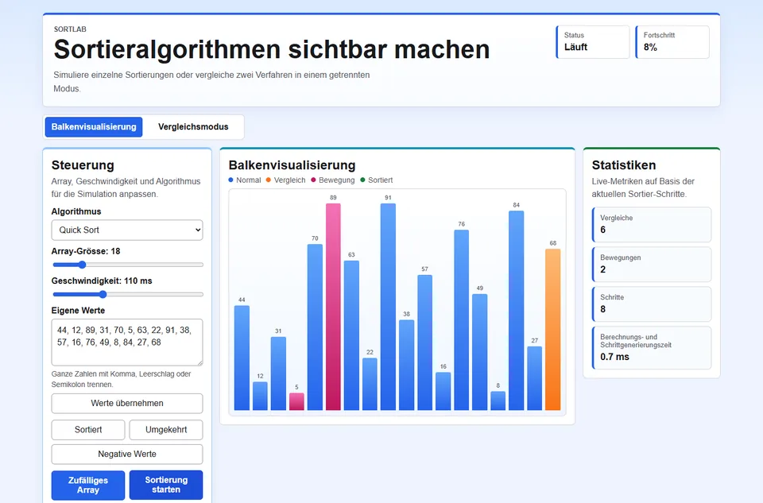

# SortLab

[Deutsch](./README.md) | **English**

SortLab is an interactive React sorting algorithm visualizer for Bubble Sort, Selection Sort, Insertion Sort, Quick Sort and Heap Sort. It shows how arrays are sorted step by step and makes comparisons, moves, animation steps, and calculation and step-generation time visible.

SortLab is built as an algorithm learning tool and portfolio project: users can try sorting methods, enter custom arrays, test negative values, and compare algorithms in comparison mode.

## Project identity

This repository is part of the public portfolio of **Aleksandar Nikolić** (**Aleksandar Nikolic**, **AleksZyro**), an IMS student from Buchs AG, Switzerland.

- Portfolio: [aleksandar-nikolic.ch](https://aleksandar-nikolic.ch/)
- GitHub: [github.com/AleksZyro](https://github.com/AleksZyro)
- Contact and current availability: [aleksandar-nikolic.ch/#contact](https://aleksandar-nikolic.ch/#contact)

<details>
<summary>Search profile</summary>

This repository is relevant for searches such as:

- sorting algorithm visualizer
- React algorithm visualization
- Bubble Sort, Selection Sort, Insertion Sort, Quick Sort and Heap Sort
- JavaScript sorting algorithms
- Vite React portfolio project
- algorithm learning tool with tests and GitHub Pages demo

</details>

- Live demo: [https://alekszyro.github.io/SortLab/](https://alekszyro.github.io/SortLab/)
- Status: **stable portfolio version**
- Tech stack: React 18, Vite 5, JavaScript, CSS, Vitest, GitHub Actions



## Demo



## Main Features

- bar visualization for sorting processes
- separate tabs for visualization and comparison mode
- random arrays with adjustable size
- custom array input with integer validation
- presets for sorted, reversed, and negative values
- controllable animation speed
- color highlighting for comparisons, moves, and sorted values
- comparison mode with two independently selectable algorithms
- statistics for comparisons, moves, animation steps, and calculation time

## Installation and Quick Start

```bash
git clone https://github.com/AleksZyro/SortLab.git
cd SortLab
npm ci
npm run dev
```

## Tests and Build

```bash
npm test
npm run build
```

<details>
<summary>Algorithms</summary>

- Bubble Sort
- Selection Sort
- Insertion Sort
- Quick Sort
- Heap Sort

</details>

<details>
<summary>Comparisons, moves and time measurement</summary>

`Comparisons` counts how often an algorithm compares values.

`Moves` counts operations that change the array. For Bubble Sort, Selection Sort, Quick Sort, and Heap Sort these are real swaps. For Insertion Sort these are shifts and inserting a value into a new position. That is why the metric is not called `swaps`.

The displayed time is called **calculation and step-generation time**. It includes calculating the sorting process and generating the animation steps for the visualization. The values are not scientific benchmarks and depend on the browser, device, and current system state.

</details>

<details>
<summary>Quality checks</summary>

Run locally:

- `npm ci`: successful
- `npm test`: successful, 42 tests passed
- `npm run build`: successful, Vite build created

The tests cover all existing sorting algorithms with an empty array, a single item, already sorted values, reverse sorted values, duplicate values, negative values, correct ascending sorting, and plausible counting of comparisons and moves.

</details>

<details>
<summary>Deployment</summary>

GitHub Pages is prepared through `.github/workflows/deploy-pages.yml`. The workflow builds with the base path `/SortLab/`, uploads `dist` as a Pages artifact, and deploys to GitHub Pages.

If deployment stops working later, this GitHub setting should be checked:

`Settings → Pages → Build and deployment → Source → GitHub Actions`

</details>

<details>
<summary>Project structure</summary>

```text
SortLab/
|- .github/
|  `- workflows/
|     |- ci.yml
|     `- deploy-pages.yml
|- docs/
|  `- assets/
|     |- sortlab-demo.webp
|     `- sortlab-demo.png
|- src/
|  |- App.jsx
|  |- main.jsx
|  |- styles.css
|  `- utils/
|     |- arrayInput.js
|     |- arrayInput.test.js
|     |- sortAlgorithms.js
|     `- sortAlgorithms.test.js
|- index.html
|- package-lock.json
|- package.json
|- vite.config.js
|- README.md
`- README_EN.md
```

</details>

<details>
<summary>Technical decisions</summary>

- The sorting functions generate states for the animation so the UI can display each step.
- The statistic uses `moves` because not every algorithm only uses real swaps.
- The time measurement is not presented as pure algorithm runtime.
- The tests check the algorithm logic independently from the React interface.
- GitHub Actions uses Node.js 22 and `npm ci`.

</details>

<details>
<summary>Known limitations</summary>

- The comparison mode shows statistics, but does not animate both algorithms in parallel.
- The time measurement depends on browser and device.
- There are no automated UI tests.
- GitHub Pages is prepared, but the repository setting must be changed manually to GitHub Actions.

</details>

<details>
<summary>Repository metadata suggestion</summary>

- Description: `Interactive React visualizer for comparing sorting algorithms and their operations.`
- Website: `https://alekszyro.github.io/SortLab/`
- Topics: `react`, `sorting-algorithms`, `algorithm-visualizer`, `bubble-sort`, `quick-sort`, `heap-sort`, `vite`, `portfolio-project`

</details>

## User Guide

A beginner-friendly German guide is available here:

[German beginner guide](BENUTZERANLEITUNG.md)

## License Status

This project is published under the MIT License. See [LICENSE](./LICENSE) for details.
